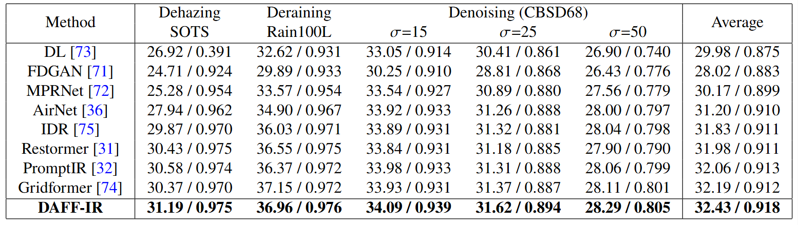
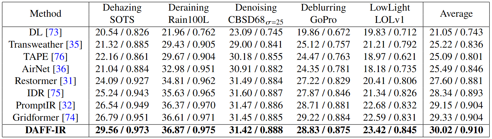
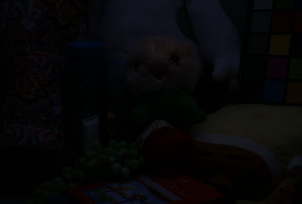

# DAFF-IR: 

Dang Duy Nguyen, Nguyen Minh Bui, Minh Duc Nguyen, [Tuan Linh Dang](https://scholar.google.com/citations?hl=en&user=jkhhgXsAAAAJ&view_op=list_works&sortby=pubdate)

<hr />

> **Abstract:** *Image restoration tasks such as dehazing, deraining, denoising, deblurring and low-light enhancement are traditionally addressed by separate specialized models. This limits their scalability and adaptability in real-world scenarios since it requires training individual models corresponding to each degradation and prior knowledge of the degradation type. To address this, we propose an all-in-one image restoration framework that unifies diverse degradation handling within a single model, where degradation information is learned and embedded into the model to adapt to specific degradation dynamically. Specifically, our method uses channel and spatial attention mechanism in parallel to adjust how the network focuses on different parts of the image, while the degradation is classified and its information is integrated into the model to guide the restoration network. We further incorporate a deep guided filter into our network, demonstrating its effectiveness across image restoration tasks. Our model, named Dual Attention Feature Fusion Image Restoration Model (DAFF-IR), achieves state-of-the-art results on several degradation types, including haze, rain, noise, blur, and low-light conditions.* 
<hr />

## Network Architecture


## Installation

See [INSTALL.md](INSTALL.md) for the installation of dependencies and dataset preperation required to run this codebase.

## Training

After preparing  the training data in a directory, change the value of ```BASE_DATA_PATH``` in ```config.py``` to the relative path to the directory, then use:
```
python train.py
```
to start training the model. Use ```chosen_degradation``` to choose the combination of degradation types to train on. E.g: ```['haze', 'rain', 'noise_25', 'blur', 'low_light']```. Note: For noise degradation, you can change the level of noise by modifying the number next to it. By default, it is set to 3 degradation types (noise, rain, and haze).

## Results

Experiments are performed for different image processing tasks including image dehazing, image deraining, image denoising, image deblurring, low-light image processing. Performance results of DAFF-IR framework for:

<summary><strong>3-degradation Results</strong> </summary>



<summary><strong>5-degradation Results</strong> </summary>



<summary><strong>Visual Results</strong> </summary>

<div align="center">
  
  
</div>

<div align="center">
  
  
</div>

<div align="center">
  
  
</div>

<div align="center">
  
  
</div>

<div align="center">
  
  
</div>

## Contact 
Should you have any question, please contact linhdt@soict.hust.edu.vn


